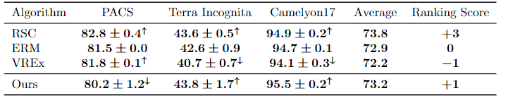
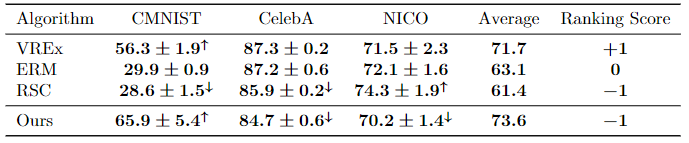

## Overview
[](http://www.youtube.com/watch?v=5UJ3fXRFhTw)

This is a fork of the [OoD-Benchmark adaptation of DomainBed](https://github.com/m-Just/DomainBed) updated with a new 
algorithm which uses both [V-REx](https://arxiv.org/pdf/2003.00688.pdf) and [RSC](https://arxiv.org/pdf/2007.02454.pdf) 
in an attempt to perform well on both diversity and correlation shift.

### Current Results
Diversity Shift: <br/>
<br/>
Correlation Shift:<br/>
<br/>

If you wish to benchmark our implementation, please follow the instructions below.

## Data preparation
All data used can be downloaded from https://drive.google.com/drive/folders/1ztqNZhn4PPZpaDvhPihipKKUBqYsqPZ5?usp=sharing.
The below describes the process for acquiring each of the datasets from official sources.

```
python domainbed/scripts/download.py --data_dir <data output directory>
```

For CelebA: 
1. download from https://drive.google.com/file/d/0B7EVK8r0v71pZjFTYXZWM3FlRnM/view?usp=sharing&resourcekey=0-dYn9z10tMJOBAkviAcfdyQ
2. Extract zip file to img_align_celeba
3. create a CelebA directory under your data directory and copy img_align_celeba into it
4. copy the contents of ood_bench_data_files/celeba into your <data dir>/CelebA directory

for NICO:
1. download from https://pan.baidu.com/s/1yS3vbx788FOtpgY9N_vVIQ password is rpds (NOTE: this requires a Chinese phone number)
2. Rename the "Animal" and "Vehicle" directories to "animal" and "vehicle"
3. Under the "animal" and "vehicle" directories add an "images" directory and copy everything in the directory into it. 
4. Run ```python nico_preprocessing.py --data_dir <path to your downloaded dataset>```
5. A few of the image file names are malformed. For example, "vehicle/truck/on_beach/83. filename-img-0989-jpg" should 
be "vehicle/truck/on_beach/83.jpg". Run ```python nico_misnamed_files.py --data_dir <path to downloaded directory``` 
to find them all. You will need to edit the file names manually (should only be a few).
6. Create a NICO directory under your data directory
7. Add the "animal" and "vehicle" directories 
8. Copy the contents of ood_bench_data_files/NICO into your <data dir>/NICO directory

## Benchmarking
```sh
sh sweep/$dataset/run.sh <launch|delete_incomplete> <local|multi_gpu> <path to datasets>
```
* launch - execute all training jobs
* delete_incomplete - remove incomplete training job folders. Necessary if you end the sweep before it completes and 
wish to continue
* local - execute a single process at a time. Assumes access to only 1 GPU at most.
* multi_gpu - executes one process per GPU

We also provide a [colab notebook](https://github.com/ChayneThrash/DomainBed/blob/main/DomainBedTesting.ipynb) which is 
already set up to run. It is recommended that you add a shortcut to the dataset google drive folder to your own google 
drive so that you may easily copy datasets into the colab environment.